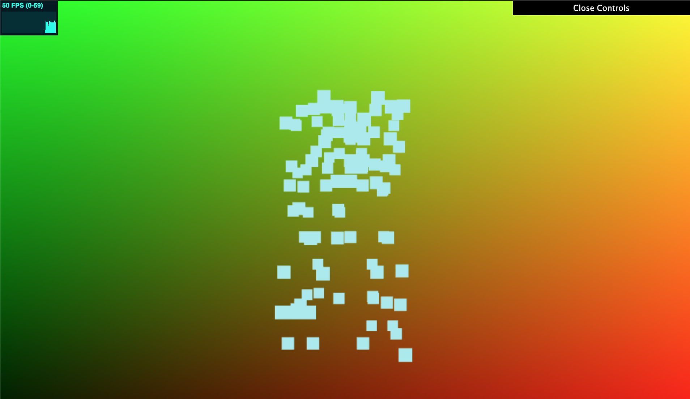

# Final Project: Rain Environment
## Amy Chen // amyjchen
## Demo Link: 

## Milestone Steps
- __Base Code__
  - I used the HW04 L-System base code, copying over my implementation of instanced rendering from that homework.
- __Particle System__
  - I created a new particle class, which has the following variables: initial position, initial velocity, acceleration, final position, final velocity
  - It contains the function getNewPos(), which takes in a deltat value (change in time) and plugs it into the equations of motion. As a result, we can calculate new positions based on constant acceleration (gravity).
  - I later added a "drag" option, where by letting drag = true, we can instead mimic a constant velocity, which is more similar to the rain effect we can perceive, since most rain has reached its terminal velocity by the time we can see it in the air.
  - The getNewPos() function also partially takes care of respawning the particle at the top, where if it hits some "ground" value (here set to be -10), it'll reset pos to be at some "sky" value (here set to be 10). It'll then update the particle class's variables and return the new calculated final position.
- __Grid__
  - I also created a grid class, which is used to set up the VBO data and represent the array of particles.
  - setVBO() sets up the instances to render in a grid-like formation, with x and z offsets. It sets up 4 vec4s, which can later be combined to form a transformation matrix.
  - setFallVBO() sets up the different frame particle positions, by setting up each value in 3 mat4s to be a new y position based on some set time increment (here, this is 1/24 of a second). In this way, we can set up essentially 48 different frames for the particle, which can be read into the shader, where a specific frame can be picked based on u_Time. Note that these values are set up differently based on if we use constant acceleration or constant velocity.
  - setPosVBO() sets up the initial position of our particle. For each particle in the grid, a random value between 1 and 48 is added to an array set up for instancing, where each instance will read one value. I adapted the instanced code for color array for this, so it is still as of now named vs_Col in the shader.
- __Instanced Vertex Shader__
  - Using the HW4 base code, I maintained billboarding, to be used when the instanced squares are later replaced with textures representing the raindrops.
  - I set up the transformation matrix based on the 4 vec4s passed in.
  - I then replace the y value in the last vec4 with a specific value in the fall position mat4s passed in:
  - I take u_Time mod 48 (since 48 is the number of frames), then add to this value the position offset (vs_Col)
  - Where the value is x, I let the xth value in the fall position mat4s be the new y value.

## Paper: Realistic Rain Rendering in Realtime
## Link: https://www.sciencedirect.com/science/article/pii/S0097849312001781?via%3Dihub
