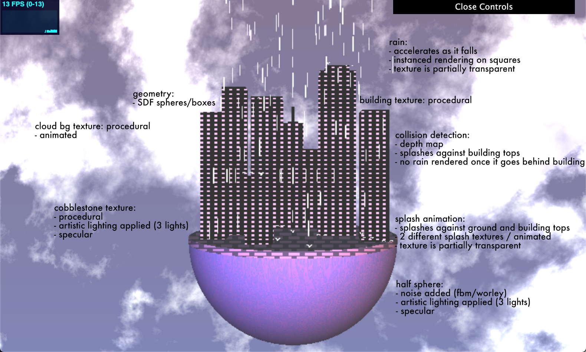

# Final Project: Rainy City
## Amy Chen // amyjchen
## Demo Link: https://merunicorn.github.io/566-final-project/

## Steps
- __Base Code__
  - I used the HW04 L-System base code, copying over my implementation of instanced rendering from that homework.
- __Particle System__
  - I created a new particle class, which has the following variables: initial position, initial velocity, acceleration, final position, final velocity
  - It contains the function getNewPos(), which takes in a deltat value (change in time) and plugs it into the equations of motion. As a result, we can calculate new positions based on constant acceleration (gravity).
  - The getNewPos() function also partially takes care of respawning the particle at the top, where if it hits some "ground" value (here set to be -10), it'll reset pos to be at some "sky" value (here set to be 15). It'll then update the particle class's variables and return the new calculated final position.
- __Grid__
  - I also created a grid class, which is used to set up the VBO data and represent the array of particles.
  - setVBO() sets up the instances to render in a grid-like formation, with x and z offsets. It sets up 4 vec4s, which can later be combined to form a transformation matrix.
  - setFallVBO() sets up the different frame particle positions, by setting up each value in 3 mat4s to be a new y position based on some set time increment (here, this is 1/24 of a second). In this way, we can set up essentially 48 different frames for the particle, which can be read into the shader, where a specific frame can be picked based on u_Time. Note that these values are set up differently based on if we use constant acceleration or constant velocity.
  - setPosVBO() sets up the initial position of our particle. For each particle in the grid, a random value between 1 and 48 is added to an array set up for instancing, where each instance will read one value. I adapted the instanced code for color array for this, so it is still as of now named vs_Col in the shader.
- __Instanced Vertex Shader__
  - I set up the transformation matrix based on the 4 vec4s passed in.
  - I then replace the y value in the last vec4 with a specific value in the fall position mat4s passed in:
  - I take u_Time mod 48 (since 48 is the number of frames), then add to this value the position offset (vs_Col)
  - Where the value is x, I let the xth value in the fall position mat4s be the new y value.
- __Depth Map__
  - Also in the instanced vertex shader, I hardcoded in a depth map
  - Based off the x/z values of the rain particle, I can determine when the particle would collide with geometry
  - I can thus set different particles in different locations to "collide" at different heights, as if they are interacting with the SDF buildings
  - I also make sure to not render raindrops past the height of a building if it's z value is behind that of a building (in other words, this ensures that we cannot see raindrops through buildings)
- __Camera__
  - I disabled camera controls, hard-coding in the values for position/eye, center/target, and up
- __Textures__
  - REFERENCED: Adam's Texture Demo
  - I imported in textures I made for the rain drop, and two different textures for the splash.
  - In the instanced shader, the texture switches to the second splash texture after 2 frames, then will stop rendering after another two frames; this simulates the animation of a splash
  - Rain and splash textures are rendered on an instance of a square
  - In the instanced fragment shader, I read in the texture (UVs set up in vertex and passed to fragment)
  - Alpha check to discard transparent fragments, so square outline is not visible
- __Procedural Textures__
  - REFERENCED: Book of Shaders Demo (https://thebookofshaders.com/09/)
  - Created a procedural square texture to use on the buildings
  - Edited to use as a "cobblestone"-like texture on the top of the half sphere/ground
  - REFERENCED: Old Homeworks/Adam's FBM, Worley Noise
  - I also used FBM and Worley Noise to add a subtle texture to the half-sphere
  - REFERENCED: Shader Toy 2d Clouds (https://www.shadertoy.com/view/4tdSWr)
  - Used code found on ShaderToy for the animated cloud background
- __Lighting__
  - REFERENCED: Old Homeworks/Emily's lighting demo
  - Applied three specular lights of different colors, directions, and intensities for an artistic lighting effect
  - Only applied to the cobblestone and half-sphere
- __SDF Geometry__
  - Sphere marched SDFs
  - REFERENCED: Old Homeworks/IQ's SDF functions
  - Used boxes and spheres, with various union and intersection operations
  - Separated into different SDF functions so I can distinguish later for different texturing,colors,etc.

## Paper: Realistic Rain Rendering in Realtime
## Link: https://www.sciencedirect.com/science/article/pii/S0097849312001781?via%3Dihub
